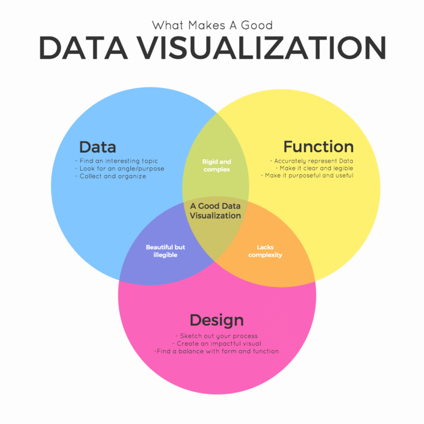

<div align="center">

# Data Visualization using Plotly

[](https://www.python.org/)
[](https://plotly.com/python/plotly-express/)
[](https://lib.umassd.edu/dish/resources/)

*Workshop materials · Digital Scholarship Hub · University of Massachusetts Dartmouth*

</div>

<br/>

<p align="center">
  
</p>

<p align="center"><em>Session graphic: the intersection of data, function, and design in strong visualizations.</em></p>

---

## Overview

This folder contains materials for a **DiSH** session on building **clear, interactive charts in Python** with **Plotly Express**, using a real dataset (`penguins.csv`) and **pandas** for preparation.

**Facilitator:** Sudhanshu Mukherjee  
**Companion page (Notion):** [Data Visualization using Plotly](https://www.notion.so/Data-Visualization-using-Plotly-ee1730db547d4b6a8b05d842573e4403?pvs=4)

---

## What is inside

| File | Description |
| --- | --- |
| `Data Visualization.ipynb` | Main workshop notebook — imports, data load, Plotly Express examples |
| `penguins.csv` | Sample dataset used in the notebook |
| `Data Visualization using Plotly.html` | Exported copy of the Notion-based outline for offline reading |

---

## Quick start

1. Create a virtual environment (recommended) and install dependencies, for example:

   ```bash
   pip install pandas numpy plotly
   ```

2. Open `Data Visualization.ipynb` in **JupyterLab**, **VS Code**, or **Cursor** and run cells top to bottom.

3. Explore Plotly’s built-in color scales when you customize charts:  
   [Plotly built-in color scales (Python)](https://plotly.com/python/builtin-colorscales/)

---

## Further reading

- **Workshop outline & context:** [Notion — Data Visualization using Plotly](https://www.notion.so/Data-Visualization-using-Plotly-ee1730db547d4b6a8b05d842573e4403?pvs=4)
- **Presenter links (from session materials):** [GitHub — sudhanshumukherjeexx](https://github.com/sudhanshumukherjeexx/Data-Visualization-Workshop) · [LinkedIn](https://www.linkedin.com/in/sudhanshumukherjeexx/)

---

## Suggested credit

> Mukherjee, S. (*Year*). *Data visualization using Plotly* [Workshop materials]. Digital Scholarship Hub, Claire T. Carney Library, University of Massachusetts Dartmouth.

Point the URL to this folder in your public GitHub repository when published.

---

<div align="center">

<sub>Digital Scholarship Hub · <a href="https://lib.umassd.edu/dish/resources/">DiSH resources</a> · <a href="https://schedule.lib.umassd.edu/calendar/dish">Workshop calendar</a></sub>

</div>
