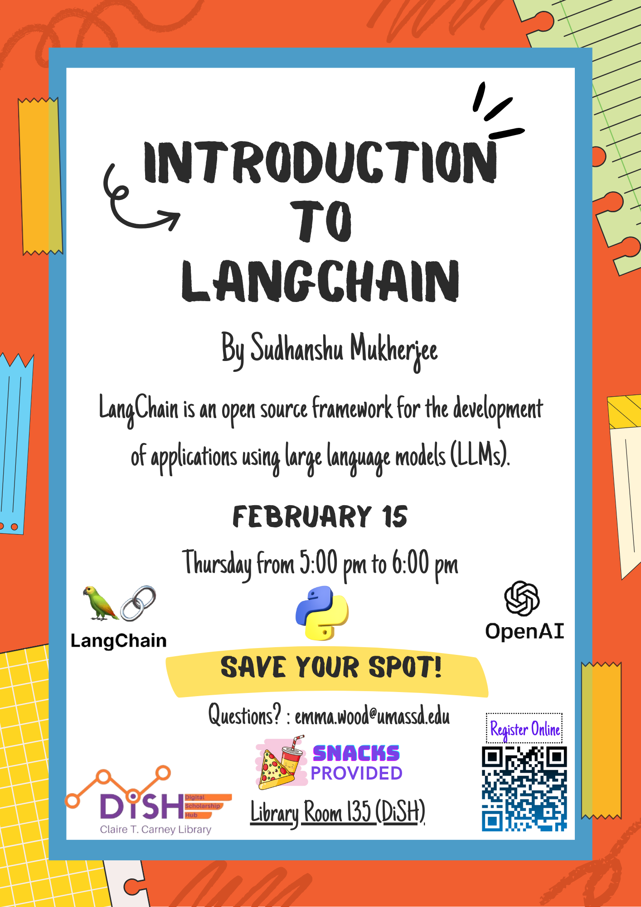

<div align="center">

# Introduction to LangChain

[](https://www.python.org/)
[](https://www.langchain.com/)
[](https://lib.umassd.edu/dish/resources/)
[](https://github.com/sudhanshumukherjeexx/DiSH-Talks)

*LLM application patterns · Digital Scholarship Hub · University of Massachusetts Dartmouth*

</div>

<br/>

<p align="center">
  
</p>

<p align="center"><em>Official session flyer (DiSH).</em></p>

---

## Session snapshot

| | |
| --- | --- |
| **Topic** | LangChain — an open-source framework for building applications with large language models (LLMs) |
| **When** | Thursday, **February 15, 2024** — 5:00–6:00 p.m. |
| **Where** | Library Room **135** (DiSH), Claire T. Carney Library |
| **Presenter** | Sudhanshu Mukherjee |
| **Host / contact** | Digital Scholarship Hub — Emma Wood · [emma.wood@umassd.edu](mailto:emma.wood@umassd.edu) |

---

## Overview

`main.ipynb` walks through core ideas such as **environment configuration**, **LLM wrappers**, and related LangChain pieces used in the live session. Use this repo as a **starting point** for your own experiments, not as a production deployment template.

---

## Setup

### 1. Python environment

From this folder, create and activate a virtual environment, then install packages (versions may vary by machine):

```bash
python -m venv env
.\env\Scripts\Activate.ps1
pip install python-dotenv langchain langchain_openai langchain_pinecone langchain_experimental langchainhub sqlalchemy typing-inspect==0.8.0 typing_extensions==4.5.0 pydantic
```

On macOS/Linux, activation is typically `source env/bin/activate`.

### 2. API keys (local only)

1. Copy `.env.example` to `.env`.
2. Fill in your own `OPENAI_API_KEY`, `PINECONE_ENV`, and `PINECONE_API_KEY`.
3. **Do not** commit `.env` — it is ignored by the repository `.gitignore`.

### 3. Run the notebook

Open `main.ipynb` in **VS Code**, **Cursor**, or **Jupyter**, select the interpreter that has your packages installed, and run **cell by cell**.

---

## Troubleshooting

- If imports fail, install the missing package with `pip install <package>` inside your **activated** environment.
- For Jupyter-only workflows, you still need a `.env` file beside the notebook so `python-dotenv` can load your keys.

---

## Optional presenter note

Some facilitators use **[Sidekick](https://join.meetsidekick.com/tha4u)** as a Chromium-based browser during live demos (vertical apps bar, built-in blocking). This is an **optional tool**, not a workshop requirement.

---

## Suggested credit

> Mukherjee, S. (*Year*). *Introduction to LangChain* [Workshop materials]. Digital Scholarship Hub, Claire T. Carney Library, University of Massachusetts Dartmouth.

---

<div align="center">

<sub>Digital Scholarship Hub · <a href="https://lib.umassd.edu/dish/resources/">DiSH resources</a> · <a href="https://schedule.lib.umassd.edu/calendar/dish">Workshop calendar</a></sub>

</div>
