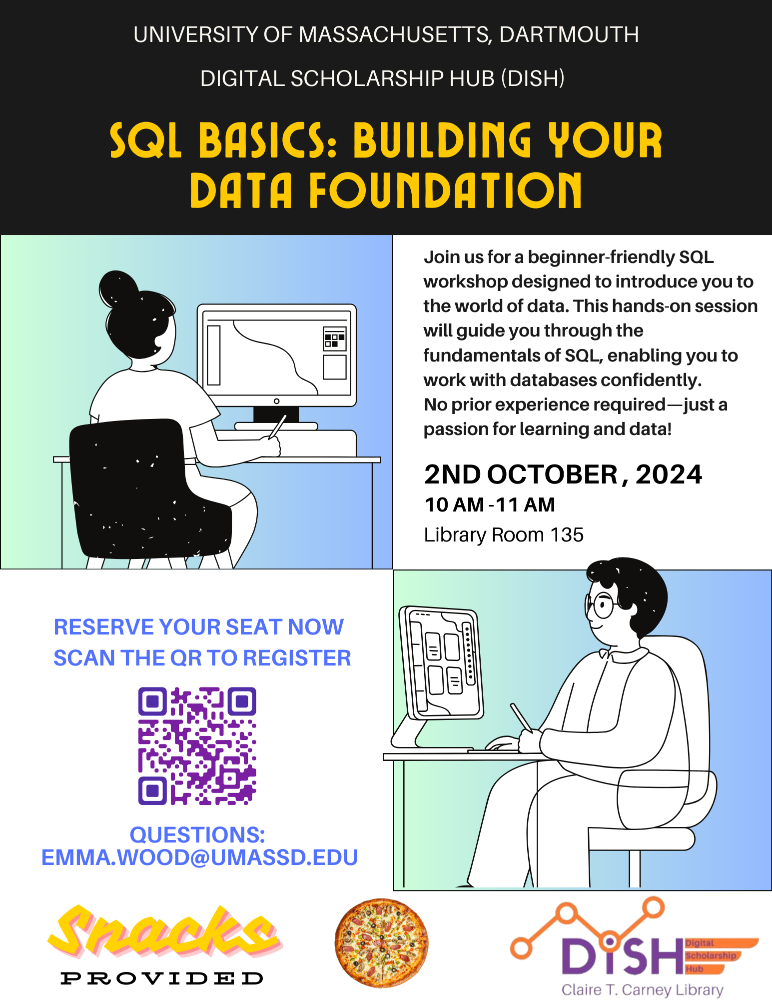

# SQL Basics: Building Your Data Foundation

*Curated learning paths · Digital Scholarship Hub · University of Massachusetts Dartmouth*

 

  

<em>Official session flyer (DiSH).</em>

 

  

---

## Session snapshot

| | |
| --- | --- |
| **Focus** | First steps in **SQL** — reading, filtering, and thinking in tables |
| **When** | Wednesday, **October 2, 2024** — 10:00–11:00 a.m. |
| **Where** | Library Room **135**, Claire T. Carney Library (DiSH) |
| **Format** | Beginner-friendly, hands-on orientation |
| **Contact** | Emma Wood · [emma.wood@umassd.edu](mailto:emma.wood@umassd.edu) |

> *No prior experience required — just curiosity about how data lives in databases.*

---

## What is in this folder

This directory primarily holds **trusted external links** you can use after the workshop: sandboxes, tutorials, practice sets, and modern helpers like text-to-SQL tools.

---

## Curated resources

| Resource | Why it helps |
| --- | --- |
| [Programiz — Online SQL editor](https://www.programiz.com/sql/online-compiler/) | Run queries in the browser with no install |
| [W3Schools — SQL tutorial](https://www.w3schools.com/sql/default.asp) | Compact syntax reference and examples |
| [SQLZoo](https://sqlzoo.net/wiki/SQL_Tutorial) | Interactive lessons with immediate feedback |
| [LeetCode — free SQL question list](https://leetcode.com/discuss/general-discussion/1208129/list-of-free-leetcode-sql-questions) | Structured practice for interview-style problems |
| [SQLCourse.com](https://www.sqlcourse.com/) | Guided course-style progression |
| [Mode — SQL tutorial](https://mode.com/sql-tutorial) | Analytics-flavored SQL |
| [Text2SQL.ai](https://www.text2sql.ai/) | Explore natural-language to SQL (use responsibly; verify output) |

---

## Suggested next steps

1. Pick **one** browser-based editor (for example Programiz) and redo the examples from the session.
2. Work through **SQLZoo** sections in order once a week.
3. When comfortable, attempt a few **LeetCode** easy SQL items and compare your answers with community solutions.

---

## Suggested credit

> Wood, E. (*Year*). *SQL basics: Building your data foundation* [Workshop resource list]. Digital Scholarship Hub, Claire T. Carney Library, University of Massachusetts Dartmouth. `https://github.com/sudhanshumukherjeexx/DiSH-Talks`

---

Digital Scholarship Hub · <a href="https://lib.umassd.edu/dish/resources/">DiSH resources</a> · <a href="https://schedule.lib.umassd.edu/calendar/dish">Workshop calendar</a>

